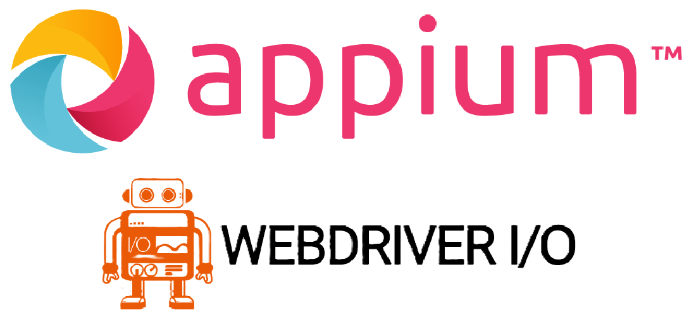

<p align="center">

</p>

<p align="center">
   <i><strong>Teste automatizado para aplicativos móveis com appium e webdriverio!
</strong></i>
<p>

---

## Pré requisitos
[](https://nodejs.org/en/download/)
[](https://code.visualstudio.com/download)
[](https://github.com/appium/appium-inspector/releases)
[](https://developer.android.com/studio)
[](https://www.azul.com/downloads/#zulu)


## Sobre
Este projeto foi criado para praticar e aplicar conhecimentos em testes automatizados, utilizando Appium com WebdriverIO no aplicativo TED Talks.

### Tecnologias usadas

* [Appium](https://appium.io/docs/en/latest/) - O Appium atua como um servidor intermediário, interpretando os comandos de teste e interagindo com o dispositivo através de drivers específicos para cada plataforma (como o UiAutomator para Android e XCUITest para iOS).
* [WebdriverIO](http://webdriver.io/) - É uma biblioteca específica para Node.js utilizada em testes automatizados de navegadores e aplicativos móveis, que facilita a interação com o protocolo WebDriver.
* [Typescript(Javascript)](https://www.typescriptlang.org/) - TypeScript é uma versão melhorada do JavaScript que adiciona recursos como tipagem de dados.

## Começando

1. Node.js instalado globalmente no sistema.
2. Java (JDK) instalado no sistema.
3. Android SDK instalado no sistema.
4. Configurar corretamente as variáveis de ambiente JAVA_HOME e ANDROID_HOME no sistema.
5. Editor de Texto/IDE (opcional) instalado, como Visual Studio Code.

**Dica:** Instale o *Appium Doctor* com o comando `npm install -g appium-doctor` e execute-o no terminal para verificar se todos os pré-requisitos estão atendidos.

## Instalação

### Setup Scripts

* Clone o repositório em uma pasta.
* Acesse a pasta clonada e execute o seguinte comando no terminal/linha de comando

```
npm install 
```


### Run Tests

* O primeiro passo é iniciar o servidor do Appium:

```
appium
```
* Em seguida, você precisa rodar os testes:

```
npm run wdio
```
